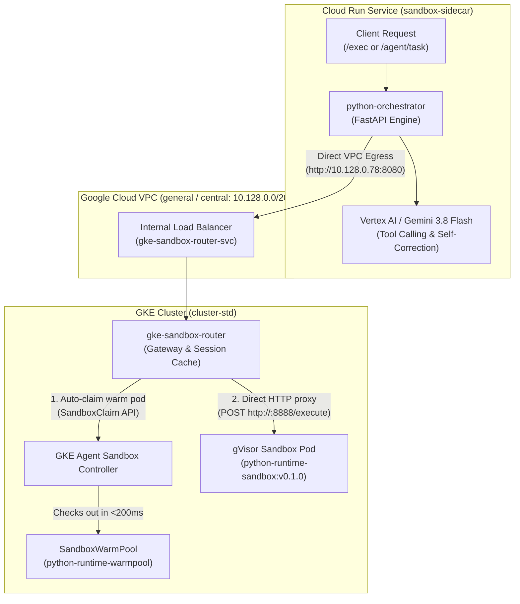

# Cloud Run Sandbox: Python Orchestrator, ComputeSDK Sidecar & Managed Agents

[](https://github.com/kenthua/cloudrun/sandbox-example)
[](https://cloud.google.com/run)
[](https://ai.google.dev/)
[](https://github.com/computesdk/computesdk/tree/main/packages/cloud-run)

This repository demonstrates how to build and deploy an **autonomous AI coding agent and sandboxed code execution service** on Google Cloud Run. It combines:
1. **Google Gen AI Interactions API (`client.interactions.create`)** for autonomous multi-turn reasoning and tool calling.
2. **ComputeSDK Cloud Run Gateway** in a sidecar container to manage secure, in-container gVisor micro-sandboxes.
3. **Python FastAPI Orchestrator** with persistent connection pooling and stateful session chaining.

---

## 📌 Origin & Attribution

This implementation evolves the patterns introduced in the Google Cloud Codelab:
* **[Execute Node.js and Python code in Cloud Run Sandboxes](https://codelabs.developers.google.com/codelabs/cloud-run/execute-nodejs-python-in-cloud-run-sandbox)**

We expanded the architecture by:
* Integrating **[ComputeSDK](https://github.com/computesdk/computesdk/tree/main/packages/cloud-run)** as an official decoupled sidecar (`gateway.mjs`).
* Enabling **Cloud Run Gen 2 (KVM MicroVM)** execution environment with startup CPU boost.
* Implementing the **Google Gen AI Managed Agents / Interactions API** so Gemini models can synthesize, run, verify, and self-correct untrusted code directly inside secure gVisor sandboxes.
* Supporting **Stateful Multi-Turn Sessions (`previous_interaction_id`)** where the agent remembers context and iterates across multi-step data pipelines.

---

## 🏗️ Architecture

The service uses a **Nested Defense-in-Depth** model:
1. **Outer Layer (Instance Isolation):** Cloud Run Gen 2 boots a hardware-isolated KVM MicroVM.
2. **Application Layer (Multi-Container Ingress & Sidecar):** Python FastAPI handles public ingress on port `8080`, manages agent interactions, and communicates with the ComputeSDK sidecar over private `localhost:8081` loopback.
3. **Inner Layer (Untrusted Code Isolation):** ComputeSDK invokes Google's `/usr/local/gcp/bin/sandbox` to launch lightweight, user-space **gVisor micro-sandboxes** with isolated memory, PID trees, and copy-on-write filesystems.

```
 ┌────────────────────────────────────────────────────────────────────────────────────────┐
 │ Google Cloud Infrastructure (Bare Metal)                                               │
 │                                                                                        │
 │  ┌──────────────────────────────────────────────────────────────────────────────────┐  │
 │  │ Cloud Run Service: sandbox-sidecar (Gen 2 KVM MicroVM)                           │  │
 │  │                                                                                  │  │
 │  │  ┌───────────────────────────────┐        ┌───────────────────────────────────┐  │  │
 │  │  │   Python Orchestrator + Agent │        │   ComputeSDK Sidecar              │  │  │
 │  │  │   (FastAPI :8080)             │───────>│   (Official Native Gateway :8081) │  │  │
 │  │  │   - Interactions API Loop     │  HTTP  │   - /v1/sandbox/do                │  │  │
 │  │  │   - Connection Pool (httpx)   │ (1ms)  └─────────────────┬─────────────────┘  │  │
 │  │  └───────────────┬───────────────┘                          │                    │  │
 │  │                  │                                          │                    │  │
 │  │       Interactions API Call                    Spawns via   │                    │  │
 │  │                  ▼                     /usr/local/gcp/bin/sandbox                │  │
 │  │        ╔══════════════════════╗             (gVisor Runtime)▼                    │  │
 │  │        ║ Gemini 3.8 / Flash   ║                     ╔═════════════════════════╗  │  │
 │  │        ║ (Tool: execute_code) ║                     ║ gVisor Inner Sandbox    ║  │  │
 │  │        ╚══════════════════════╝                     ║ - Syscalls intercepted  ║  │  │
 │  │                                                     ║ - Ephemeral filesystem  ║  │  │
 │  │                                                     ║ - Runs untrusted code   ║  │  │
 │  │                                                     ╚═════════════════════════╝  │  │
 │  └──────────────────────────────────────────────────────────────────────────────────┘  │
 └────────────────────────────────────────────────────────────────────────────────────────┘
```

---

## 📂 Repository Structure

```
.
├── gke-router/
│   ├── Dockerfile                 # Python 3.11 container with uv for fast installs
│   ├── pyproject.toml             # uv / standard project packaging (no requirements.txt needed)
│   └── main.py                    # FastAPI gateway managing SandboxClaims & execution proxies
│
├── k8s/
│   ├── 00-sandbox-template.yaml   # Official GKE SandboxTemplate blueprint (gVisor runtime)
│   ├── 00-sandbox-warmpool.yaml   # Official GKE SandboxWarmPool spec (pre-warmed pods)
│   ├── 00-sandbox-claim.yaml      # Sample SandboxClaim resource definition
│   ├── 01-rbac.yaml               # ServiceAccount, ClusterRole, and Bindings for Sandbox router
│   ├── 02-router-deployment.yaml  # 2-replica deployment for gke-sandbox-router
│   └── 03-router-service.yaml     # Internal Load Balancer service (10.128.0.78:8080)
│
├── orchestrator/
│   ├── Dockerfile                 # Python 3.11 container with uv for fast installs
│   ├── pyproject.toml             # uv / standard project packaging (no requirements.txt needed)
│   ├── main.py                    # Ingress FastAPI orchestrator with connection pooling
│   └── agent_runner.py            # Vertex AI Gemini agent loop & session routing
│
├── sidecar/
│   ├── Dockerfile                 # Multi-runtime image running official ComputeSDK gateway
│   └── package.json               # @computesdk/cloud-run dependency
│
├── scripts/
│   ├── 01_build_all_images.sh                  # [Setup 1] Cloud Build all 3 containers with uv
│   ├── 02_deploy_gke_sandbox.sh                # [Setup 2] Deploy GKE warmpool CRDs & router
│   ├── 03_deploy_cloud_run.sh                  # [Setup 3] Deploy multi-container Cloud Run service
│   ├── 04_demo_scenario1_cloudrun_sandbox.py   # [Scenario 1] Python programmatic test runner
│   ├── 04_demo_scenario1_cloudrun_sandbox.sh   # [Scenario 1] Bash / cURL raw HTTP runner
│   ├── 05_demo_scenario2_managed_agent.py      # [Scenario 2] Python programmatic test runner
│   ├── 05_demo_scenario2_managed_agent.sh      # [Scenario 2] Bash / cURL raw HTTP runner
│   ├── 06_demo_scenario3_gke_agent_sandbox.py  # [Scenario 3] Python multi-turn stateful test suite
│   ├── 06_demo_scenario3_gke_agent_sandbox.sh  # [Scenario 3] Bash / cURL raw HTTP runner
│   └── 07_run_all_scenarios.sh                 # [Test Suite] Runs all scenarios & records to TEST_RESULTS.md
│
├── TEST_RESULTS.md                 # Full recorded execution log of all live test runs
├── service.yaml                   # Knative multi-container Cloud Run deployment configuration
├── .gitignore                     # Git ignore rules for Python & Node.js
└── README.md                      # Documentation & architecture guide
```

---

### 💡 Understanding the Demo Scripts: Python (`.py`) vs. Bash/cURL (`.sh`)

For each scenario, we provide both a **Python runner** and a **Bash runner**. They serve two distinct purposes:

| Type | Format | Target Audience / Purpose | What it Does |
| :--- | :--- | :--- | :--- |
| **Python Test Runner** | `.py` | **Automated Testing & CI/CD** | Programmatic test suite using `httpx`. Executes multi-turn steps sequentially, verifies state persistence across turns (e.g. Turn 1 $\rightarrow$ Turn 2 $\rightarrow$ Turn 3), checks intermediate `/tmp` files, inspects Pod IPs, and automatically releases claims. |
| **Bash / cURL Runner** | `.sh` | **Quick CLI Inspection & API Examples** | Lightweight shell scripts demonstrating raw HTTP `POST` and `DELETE` calls with `curl` and `jq`. Ideal for copy-pasting into your terminal, Postman, or integrating into non-Python applications. |

---

## 🧪 Distinct Scenarios & Invocations

Every scenario is **distinct, decoupled, and explicitly invokable** at runtime via dedicated endpoints or the `backend` field:

```
┌────────────────────────────────────────────────────────────────────────────────────────┐
│                                 Cloud Run AI Gateway                                   │
├──────────────────────────┬─────────────────────────────┬───────────────────────────────┤
│ 1. Cloud Run Sandbox     │ 2. Managed Agent AI Loop    │ 3. GKE Agent Sandbox          │
│    (In-Container gVisor) │    (Vertex AI Gemini Loop)  │    (Distributed Warmpools)    │
│    POST /sandbox/exec    │    POST /agent/task         │    POST /gke/exec             │
│                          │    POST /sandbox/agent/task │    POST /gke/agent/task       │
└──────────────────────────┴─────────────────────────────┴───────────────────────────────┘
```

---

### Scenario 1: Cloud Run In-Container Sandbox (`POST /sandbox/exec`)

Directly executes code inside Cloud Run's local gVisor micro-sandbox via ComputeSDK:

```bash
curl -s -X POST "$SERVICE_URL/sandbox/exec" \
  -H "Authorization: Bearer $TOKEN" \
  -H "Content-Type: application/json" \
  -d '{"language": "python", "code": "import sys; print(f\"Executed on Cloud Run local sidecar Python {sys.version.split()[0]}\")"}'
```

#### Run the Automated Scenario 1 Demonstration:

```bash
# Python runner:
python3 scripts/04_demo_scenario1_cloudrun_sandbox.py

# Or Bash / cURL runner:
./scripts/04_demo_scenario1_cloudrun_sandbox.sh
```

---

### Scenario 2: Managed Agent AI Reasoning Loop (`POST /agent/task`)

Autonomous problem-solving loop where Vertex AI Gemini formulates a solution, runs code in the sandbox, inspects output, and self-corrects:

```bash
curl -s -X POST "$SERVICE_URL/agent/task" \
  -H "Authorization: Bearer $TOKEN" \
  -H "Content-Type: application/json" \
  -d '{"prompt": "Calculate 15 squared plus the square root of 144 using Python and print the result"}'
```

*Note: You can target the agent loop to the local sidecar via `POST /sandbox/agent/task` or GKE via `POST /gke/agent/task`.*

#### Run the Automated Scenario 2 Demonstration:

```bash
# Python runner:
python3 scripts/05_demo_scenario2_managed_agent.py

# Or Bash / cURL runner:
./scripts/05_demo_scenario2_managed_agent.sh
```

---

### Scenario 3: GKE Agent Sandbox Distributed Warmpool (`POST /gke/exec`)

Routes requests across Google Cloud VPC to **GKE Agent Sandbox** warmpools (`extensions.agents.x-k8s.io/v1alpha1`) with sub-second pod checkout:

```bash
curl -s -X POST "$SERVICE_URL/gke/exec" \
  -H "Authorization: Bearer $TOKEN" \
  -H "Content-Type: application/json" \
  -d '{"language": "python", "code": "import socket; print(f\"Executed on GKE Sandbox Pod: {socket.gethostname()}\")"}'
```



#### Key Highlights of Scenario 3:
1. **Sub-second Checkout:** Claims a pre-warmed gVisor sandbox instance from `SandboxWarmPool/python-runtime-warmpool` in `<200ms`.
2. **Persistent Multi-Turn State:** Filesystem and process state persist across turns using `session_id` (e.g. saving state in Turn 1, calculating norms in Turn 2).
3. **Autonomous Gemini Loop:** Gemini model synthesizes code, calls `execute_sandbox_code`, inspects execution results from the GKE sandbox, and self-corrects runtime errors.
4. **Lifecycle & Cleanup:** `SandboxClaim` resources can be released on demand or automatically cleaned up.

#### Preparing the GKE Agent Sandbox Environment:

1. **Create a gVisor-Enabled Node Pool (Required for GKE Standard)**:
   ```bash
   gcloud container node-pools create gvisor-agents-e2 \
       --cluster ${CLUSTER_NAME} \
       --region ${REGION} \
       --machine-type e2-standard-4 \
       --image-type cos_containerd \
       --sandbox type=gvisor \
       --enable-autoscaling \
       --min-nodes 1 \
       --max-nodes 5
   ```
   > *Note: For GKE Autopilot clusters, node pools and gVisor sandboxing are provisioned automatically on demand when workloads request `runtimeClassName: gvisor`.*

2. **Enable Agent Sandbox on the GKE Cluster**:
   ```bash
   gcloud beta container clusters update ${CLUSTER_NAME} \
       --region ${REGION} \
       --enable-agent-sandbox
   ```

3. **Deploy Blueprint & Warm Pool**:
   ```bash
   # Deploy SandboxTemplate (gVisor blueprint)
   kubectl apply -f k8s/00-sandbox-template.yaml

   # Deploy SandboxWarmPool (pre-warmed ready replicas)
   kubectl apply -f k8s/00-sandbox-warmpool.yaml
   ```

4. **Deploy GKE Sandbox Router (ILB & Session Gateway)**:
   ```bash
   kubectl apply -f k8s/01-rbac.yaml
   kubectl apply -f k8s/02-router-deployment.yaml
   kubectl apply -f k8s/03-router-service.yaml
   ```

#### Run the Automated Scenario 3 Demonstration:

```bash
# Python runner:
python3 scripts/06_demo_scenario3_gke_agent_sandbox.py

# Or Bash / cURL runner:
./scripts/06_demo_scenario3_gke_agent_sandbox.sh
```

---

## 🚀 Deployment Guide & Automation Scripts

We provide end-to-end automation scripts and CLI commands for builds, Cloud Run, and GKE.

### 1. Build All Container Images (with `uv`)

All Python containers use [uv](https://github.com/astral-sh/uv) (`COPY --from=ghcr.io/astral-sh/uv:latest /uv /uvx /bin/` and `uv pip install --system -r pyproject.toml`) for ultra-fast, sub-second dependency installation:

```bash
# Automated build runner
./scripts/01_build_all_images.sh
```

*Or via direct `gcloud` commands:*
```bash
PROJECT_ID=$(gcloud config get-value project)
REGION="us-central1"
REGISTRY="${REGION}-docker.pkg.dev/${PROJECT_ID}/cloud-run-source-deploy"

# 1. Python Orchestrator
gcloud builds submit orchestrator --tag "${REGISTRY}/python-orchestrator:latest" --region "${REGION}"

# 2. ComputeSDK Sidecar
gcloud builds submit sidecar --tag "${REGISTRY}/computesdk-sidecar:latest" --region "${REGION}"

# 3. GKE Sandbox Router
gcloud builds submit gke-router --tag "${REGISTRY}/gke-sandbox-router:latest" --region "${REGION}"
```

---

### 2. Deploy Cloud Run Service

Deploy the multi-container Cloud Run service with Direct VPC Egress enabled:

```bash
# Automated deployment script
./scripts/03_deploy_cloud_run.sh
```

*Or via declarative Knative YAML (`service.yaml`):*
```bash
gcloud run services replace service.yaml --region us-central1
```

*Or via direct `gcloud` CLI flags:*
```bash
gcloud beta run deploy sandbox-sidecar \
    --region us-central1 \
    --container python-orchestrator \
    --image us-central1-docker.pkg.dev/kenthua-alto-agents/cloud-run-source-deploy/python-orchestrator:latest \
    --port 8080 \
    --container computesdk-sidecar \
    --image us-central1-docker.pkg.dev/kenthua-alto-agents/cloud-run-source-deploy/computesdk-sidecar:latest \
    --network general \
    --subnet central \
    --vpc-egress private-ranges-only \
    --set-env-vars "GOOGLE_GENAI_USE_VERTEXAI=true,GOOGLE_CLOUD_PROJECT=kenthua-alto-agents,GOOGLE_CLOUD_LOCATION=us-central1,GKE_ROUTER_URL=http://10.128.0.78:8080" \
    --execution-environment gen2 \
    --allow-unauthenticated
```

---

### 3. Deploy GKE Agent Sandbox & Router

```bash
# Automated GKE deploy runner
./scripts/02_deploy_gke_sandbox.sh
```

*Or via direct `kubectl` commands:*
```bash
# 1. Agent Sandbox Warmpool
kubectl apply -f k8s/00-sandbox-template.yaml
kubectl apply -f k8s/00-sandbox-warmpool.yaml

# 2. Router Deployment & Internal Load Balancer
kubectl apply -f k8s/01-rbac.yaml
kubectl apply -f k8s/02-router-deployment.yaml
kubectl apply -f k8s/03-router-service.yaml
```

