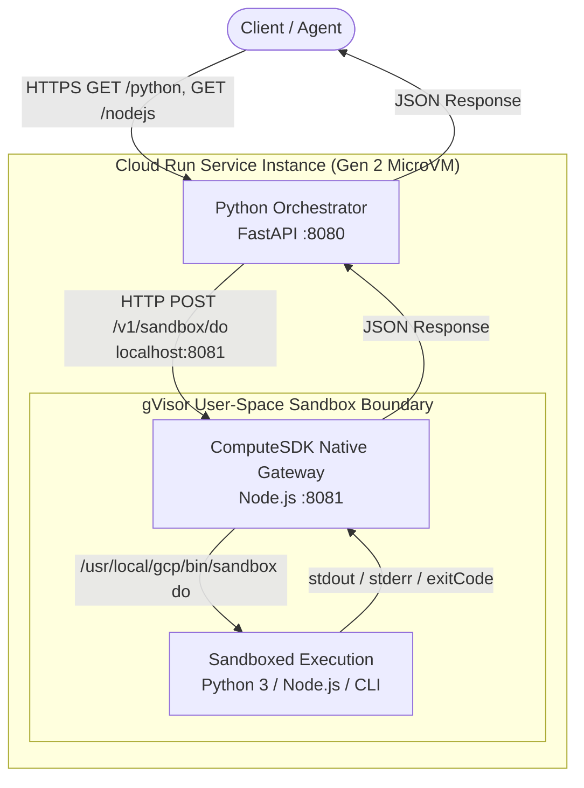

# Cloud Run Sandbox: Python Orchestrator with ComputeSDK Sidecar

[](https://github.com/kenthua/cloudrun/sandbox-example)
[](https://cloud.google.com/run)
[](https://github.com/computesdk/computesdk/tree/main/packages/cloud-run)

This repository demonstrates how to build and deploy a **multi-container (sidecar) code execution service** on Google Cloud Run. It unites a **Python FastAPI Orchestrator** with **ComputeSDK's Cloud Run Gateway** in a single Cloud Run deployment unit to run isolated, sandboxed Python and Node.js code securely.

---

## 📌 Origin & Attribution

This implementation is based on the Google Cloud Codelab:
* **[Execute Node.js and Python code in Cloud Run Sandboxes](https://codelabs.developers.google.com/codelabs/cloud-run/execute-nodejs-python-in-cloud-run-sandbox)**

We evolved the codelab pattern by integrating **[ComputeSDK](https://github.com/computesdk/computesdk/tree/main/packages/cloud-run)** as a decoupled sidecar container, providing a structured, language-agnostic REST API (`/v1/sandbox/do`) to manage in-container gVisor execution lifecycles.

---

## 🏗️ Architecture

The service uses a **Nested Defense-in-Depth** model:
1. **Outer Layer (Instance Isolation):** Cloud Run Gen 2 boots a dedicated, hardware-isolated KVM MicroVM.
2. **Application Layer (Multi-Container Ingress & Sidecar):** Python FastAPI handles public ingress on port `8080` and forwards execution payloads over private `localhost:8081` loopback to the ComputeSDK sidecar.
3. **Inner Layer (Untrusted Code Isolation):** ComputeSDK invokes Google's `/usr/local/gcp/bin/sandbox` to spawn lightweight, user-space **gVisor micro-sandboxes** with dedicated memory, PID trees, and copy-on-write filesystems.

```
 ┌───────────────────────────────────────────────────────────────────────────────────┐
 │ Google Cloud Infrastructure (Bare Metal)                                          │
 │                                                                                   │
 │  ┌─────────────────────────────────────────────────────────────────────────────┐  │
 │  │ Cloud Run Service: sandbox-sidecar (Gen 2 KVM MicroVM)                      │  │
 │  │                                                                             │  │
 │  │  ┌─────────────────────────────┐        ┌────────────────────────────────┐  │  │
 │  │  │   Python Orchestrator       │        │   ComputeSDK Sidecar           │  │  │
 │  │  │   (Ingress Container)       │───────>│   (Official Native Gateway)    │  │  │
 │  │  │   Port: 8080 (FastAPI)      │  HTTP  │   Port: 8081 (Node.js)         │  │  │
 │  │  └─────────────────────────────┘ (1ms)  └───────────────┬────────────────┘  │  │
 │  │                                                         │                   │  │
 │  │                                     Spawns via          │                   │  │
 │  │                            /usr/local/gcp/bin/sandbox   │                   │  │
 │  │                                (gVisor Runtime)         ▼                   │  │
 │  │                                        ╔═════════════════════════════════╗  │  │
 │  │                                        ║  gVisor Inner Micro-Sandbox     ║  │  │
 │  │                                        ║  - Syscalls intercepted         ║  │  │
 │  │                                        ║  - Ephemeral /tmp filesystem    ║  │  │
 │  │                                        ║  - Isolated memory & PID tree   ║  │  │
 │  │                                        ║  - Runs untrusted user code     ║  │  │
 │  │                                        ╚═════════════════════════════════╝  │  │
 │  └─────────────────────────────────────────────────────────────────────────────┘  │
 └───────────────────────────────────────────────────────────────────────────────────┘
```



---

## ⚡ Performance Benchmark: Gen 1 vs. Gen 2 MicroVM

Tests were conducted against the deployed service comparing Cloud Run's **Gen 1** execution environment with **Gen 2 (KVM MicroVM)**:

| Endpoint | Workload Description | Gen 1 Latency | Gen 2 MicroVM Latency | Improvement |
| :--- | :--- | :--- | :--- | :--- |
| `GET /` | Root Health Check & Discovery | `~0.44s` | **`~0.20s`** | **~54% faster** |
| `GET /python` | Sandboxed Python evaluation (`print(20 + 45)`) | `~1.35s` | **`~1.60s`** | Comparable |
| `GET /nodejs` | Dynamic `npm install is-odd` + sandboxed run | `~7.20s` (install: 6s) | **`~4.21s`** (install: 3s) | **~41% faster** |

> [!NOTE]
> **Performance Disclaimer:** All benchmark and performance measurements vary depending on instance CPU/memory allocations, cold-start vs. warm instances, container image layers, network bandwidth to package registries, and regional latency. The figures above are for illustrative test purposes only.

---

## 💡 Key Architectural Highlights

* **Decoupled Runtimes:** Your core orchestrator remains pure Python. You do not need to install Node.js, `npm`, or complex toolchains inside your Python container.
* **Zero Custom Server Wrapper Maintenance:** The sidecar executes ComputeSDK's official built-in gateway (`@computesdk/cloud-run/dist/gateway.mjs`), requiring zero custom JavaScript server code.
* **Language-Agnostic Sandbox:** ComputeSDK executes arbitrary shell commands inside `/usr/local/gcp/bin/sandbox`. Any language compiler or CLI tool available in the sidecar image (Python, Node.js, Go, Rust, ffmpeg, etc.) can be sandboxed.
* **Strict Blast Radius Containment:** Any memory exhaustion (`OOM`), infinite loops, or malicious code executions are contained inside the inner gVisor sandbox boundary and destroyed upon completion.

---

## 📂 Repository Structure

```
.
├── orchestrator/
│   ├── Dockerfile                 # Lightweight Python 3.11 container (FastAPI + uvicorn)
│   ├── main.py                    # Ingress FastAPI orchestrator calling sidecar over localhost
│   └── requirements.txt           # fastapi, uvicorn, httpx
│
├── sidecar/
│   ├── Dockerfile                 # Python + Node.js image running official ComputeSDK gateway
│   └── package.json               # @computesdk/cloud-run dependency
│
├── service.yaml                   # Knative multi-container Cloud Run deployment configuration
├── .gitignore                     # Git ignore rules for Python & Node.js
└── README.md                      # Documentation & architecture guide
```

---

## 🚀 Quickstart & Deployment Guide

### 1. Clone the Repository

```bash
git clone git@github.com:kenthua/cloudrun/sandbox-example.git
cd sandbox-example
```

### 2. Prerequisites

* Google Cloud SDK (`gcloud`) installed and authenticated.
* Google Cloud Project with Cloud Run and Cloud Build APIs enabled:
  ```bash
  gcloud services enable run.googleapis.com cloudbuild.googleapis.com
  ```

### 3. Build Container Images

Set your Google Cloud Project ID and build both container images using Cloud Build:

```bash
PROJECT_ID=$(gcloud config get-value project)

# 1. Build Python Orchestrator image
gcloud builds submit --tag us-central1-docker.pkg.dev/$PROJECT_ID/cloud-run-source-deploy/python-orchestrator:latest ./orchestrator

# 2. Build ComputeSDK Sidecar image
gcloud builds submit --tag us-central1-docker.pkg.dev/$PROJECT_ID/cloud-run-source-deploy/computesdk-sidecar:latest ./sidecar
```

### 4. Deploy Multi-Container Service

Apply the multi-container configuration in [`service.yaml`](file:///home/kenthua/cr-sandbox/service.yaml):

```bash
gcloud beta run services replace service.yaml --region us-central1
```

---

## 🧪 Testing the Endpoints

Retrieve the service URL and test the live endpoints:

```bash
SERVICE_URL=$(gcloud run services describe sandbox-sidecar --region us-central1 --format 'value(status.url)')
TOKEN=$(gcloud auth print-identity-token)

# 1. Service Status
curl -s -X GET "$SERVICE_URL/" -H "Authorization: Bearer $TOKEN"

# 2. Sandboxed Python Execution
curl -s -X GET "$SERVICE_URL/python" -H "Authorization: Bearer $TOKEN"

# 3. Sandboxed Node.js Execution (with live npm install)
curl -s -X GET "$SERVICE_URL/nodejs" -H "Authorization: Bearer $TOKEN"
```
