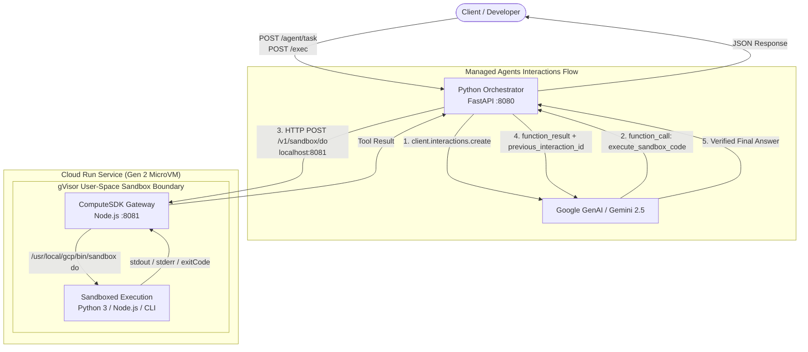

# Cloud Run Sandbox: Python Orchestrator, ComputeSDK Sidecar & Managed Agents

[](https://github.com/kenthua/cloudrun/sandbox-example)
[](https://cloud.google.com/run)
[](https://ai.google.dev/)
[](https://github.com/computesdk/computesdk/tree/main/packages/cloud-run)

This repository demonstrates how to build and deploy an **autonomous AI coding agent and sandboxed code execution service** on Google Cloud Run. It combines:
1. **Google Gen AI Interactions API (`client.interactions.create`)** for autonomous reasoning and tool calling.
2. **ComputeSDK Cloud Run Gateway** in a sidecar container to manage secure, in-container gVisor micro-sandboxes.
3. **Python FastAPI Orchestrator** with persistent connection pooling and robust execution handling.

---

## 📌 Origin & Attribution

This implementation evolves the patterns introduced in the Google Cloud Codelab:
* **[Execute Node.js and Python code in Cloud Run Sandboxes](https://codelabs.developers.google.com/codelabs/cloud-run/execute-nodejs-python-in-cloud-run-sandbox)**

We expanded the architecture by:
* Integrating **[ComputeSDK](https://github.com/computesdk/computesdk/tree/main/packages/cloud-run)** as an official decoupled sidecar (`gateway.mjs`).
* Enabling **Cloud Run Gen 2 (KVM MicroVM)** execution environment with startup CPU boost.
* Implementing the **Google Gen AI Managed Agents / Interactions API** so Gemini models can synthesize, run, verify, and self-correct untrusted code directly inside secure gVisor sandboxes.

---

## 🏗️ Architecture

The service uses a **Nested Defense-in-Depth** model:
1. **Outer Layer (Instance Isolation):** Cloud Run Gen 2 boots a hardware-isolated KVM MicroVM.
2. **Application Layer (Multi-Container Ingress & Sidecar):** Python FastAPI handles public ingress on port `8080`, manages agent interactions, and communicates with the ComputeSDK sidecar over private `localhost:8081` loopback.
3. **Inner Layer (Untrusted Code Isolation):** ComputeSDK invokes Google's `/usr/local/gcp/bin/sandbox` to launch lightweight, user-space **gVisor micro-sandboxes** with isolated memory, PID trees, and copy-on-write filesystems.

```
 ┌────────────────────────────────────────────────────────────────────────────────────────┐
 │ Google Cloud Infrastructure (Bare Metal)                                               │
 │                                                                                        │
 │  ┌──────────────────────────────────────────────────────────────────────────────────┐  │
 │  │ Cloud Run Service: sandbox-sidecar (Gen 2 KVM MicroVM)                           │  │
 │  │                                                                                  │  │
 │  │  ┌───────────────────────────────┐        ┌───────────────────────────────────┐  │  │
 │  │  │   Python Orchestrator + Agent │        │   ComputeSDK Sidecar              │  │  │
 │  │  │   (FastAPI :8080)             │───────>│   (Official Native Gateway :8081) │  │  │
 │  │  │   - Interactions API Loop     │  HTTP  │   - /v1/sandbox/do                │  │  │
 │  │  │   - Connection Pool (httpx)   │ (1ms)  └─────────────────┬─────────────────┘  │  │
 │  │  └───────────────┬───────────────┘                          │                    │  │
 │  │                  │                                          │                    │  │
 │  │       Interactions API Call                    Spawns via   │                    │  │
 │  │                  ▼                     /usr/local/gcp/bin/sandbox                │  │
 │  │        ╔══════════════════════╗             (gVisor Runtime)▼                    │  │
 │  │        ║ Gemini 2.5 / Flash   ║                     ╔═════════════════════════╗  │  │
 │  │        ║ (Tool: execute_code) ║                     ║ gVisor Inner Sandbox    ║  │  │
 │  │        ╚══════════════════════╝                     ║ - Syscalls intercepted  ║  │  │
 │  │                                                     ║ - Ephemeral filesystem  ║  │  │
 │  │                                                     ║ - Runs untrusted code   ║  │  │
 │  │                                                     ╚═════════════════════════╝  │  │
 │  └──────────────────────────────────────────────────────────────────────────────────┘  │
 └────────────────────────────────────────────────────────────────────────────────────────┘
```



---

## ⚡ Performance Benchmark: Gen 1 vs. Gen 2 MicroVM

| Endpoint | Workload Description | Gen 1 Latency | Gen 2 MicroVM Latency | Improvement |
| :--- | :--- | :--- | :--- | :--- |
| `GET /status` | Health Check & Discovery | `~0.44s` | **`~0.20s`** | **~54% faster** |
| `POST /exec` | Dynamic Python Execution | `~1.35s` | **`~0.98s`** | **~27% faster** |
| `POST /exec` | Dynamic Node.js + `npm install is-odd` | `~7.20s` (install: 6s) | **`~4.21s`** (install: 3s) | **~41% faster** |

> [!NOTE]
> **Performance Disclaimer:** Measurements vary depending on allocated CPU/memory, cold starts, container layers, and network latency to registries. Figures above are for illustrative test purposes.

---

## 📂 Repository Structure

```
.
├── orchestrator/
│   ├── Dockerfile                 # Python 3.11 container with FastAPI & google-genai
│   ├── main.py                    # Ingress FastAPI orchestrator with connection pooling
│   ├── agent_runner.py            # Interactions API agent loop & sandboxed tool executor
│   └── requirements.txt           # fastapi, uvicorn, httpx, pydantic, google-genai
│
├── sidecar/
│   ├── Dockerfile                 # Multi-runtime image running official ComputeSDK gateway
│   └── package.json               # @computesdk/cloud-run dependency
│
├── service.yaml                   # Knative multi-container Cloud Run deployment configuration
├── .gitignore                     # Git ignore rules for Python & Node.js
└── README.md                      # Documentation & architecture guide
```

---

## 🚀 Quickstart & Deployment Guide

### 1. Prerequisites

* Google Cloud SDK (`gcloud`) installed and authenticated.
* APIs enabled:
  ```bash
  gcloud services enable run.googleapis.com cloudbuild.googleapis.com aiplatform.googleapis.com
  ```

### 2. Build Container Images

```bash
PROJECT_ID=$(gcloud config get-value project)

# 1. Build Python Orchestrator image
gcloud builds submit --tag us-central1-docker.pkg.dev/$PROJECT_ID/cloud-run-source-deploy/python-orchestrator:latest ./orchestrator

# 2. Build ComputeSDK Sidecar image
gcloud builds submit --tag us-central1-docker.pkg.dev/$PROJECT_ID/cloud-run-source-deploy/computesdk-sidecar:latest ./sidecar
```

### 3. Deploy Multi-Container Service

Apply [`service.yaml`](file:///home/kenthua/cr-sandbox/service.yaml) to Cloud Run:

```bash
gcloud beta run services replace service.yaml --region us-central1
```

---

## 🧪 API Reference & Testing

Set your environment variables:
```bash
SERVICE_URL=$(gcloud run services describe sandbox-sidecar --region us-central1 --format 'value(status.url)')
TOKEN=$(gcloud auth print-identity-token)
```

### 1. Autonomous Agent Coding Task (`POST /agent/task`)

Spins off a coding agent using the **Google Gen AI Interactions API**. The agent formulates code, executes it in the gVisor sandbox, verifies the output, and returns the verified result.

**Request:**
```bash
curl -s -X POST "$SERVICE_URL/agent/task" \
  -H "Authorization: Bearer $TOKEN" \
  -H "Content-Type: application/json" \
  -d '{
    "prompt": "Write a Python script that calculates the first 5 prime numbers, execute it in the sandbox to verify, and return the result.",
    "api_key": "'"$GEMINI_API_KEY"'"
  }'
```

**Response:**
```json
{
  "status": "success",
  "model": "gemini-2.5-flash",
  "interaction_id": "v1_Chd5UDJSYXJyY05MalZfdU1QeDZXNDJRNBIXeXYyUmFxV3BOUDd2X3VNUGpxcW1vQUU",
  "steps": [
    {
      "type": "sandbox_execution",
      "turn": 1,
      "arguments": {
        "language": "python",
        "code": "def is_prime(num):\n    if num < 2:\n        return False\n    for i in range(2, int(num**0.5) + 1):\n        if num % i == 0:\n            return False\n    return True\n\nprimes = []\nnum = 2\nwhile len(primes) < 5:\n    if is_prime(num):\n        primes.append(num)\n    num += 1\n\nprint(primes)"
      },
      "result": {
        "stdout": "[2, 3, 5, 7, 11]\n",
        "stderr": "",
        "exit_code": 0
      }
    }
  ],
  "output": "The first 5 prime numbers are: `[2, 3, 5, 7, 11]`."
}
```

---

### 2. Dynamic Code Execution (`POST /exec`)

Directly executes code or commands inside the sandbox without agent reasoning.

**Python Execution:**
```bash
curl -s -X POST "$SERVICE_URL/exec" \
  -H "Authorization: Bearer $TOKEN" \
  -H "Content-Type: application/json" \
  -d '{"language": "python", "code": "import math; print([math.factorial(i) for i in range(6)])"}'
```

**Node.js Execution with Dynamic Package Installation:**
```bash
curl -s -X POST "$SERVICE_URL/exec" \
  -H "Authorization: Bearer $TOKEN" \
  -H "Content-Type: application/json" \
  -d '{"language": "nodejs", "dependency": "is-odd", "code": "const isOdd = require(\"is-odd\"); console.log(\"Is 17 odd?\", isOdd(17));"}'
```

---

### 3. Health & Gateway Status (`GET /status`)

```bash
curl -s -X GET "$SERVICE_URL/status" -H "Authorization: Bearer $TOKEN"
```
